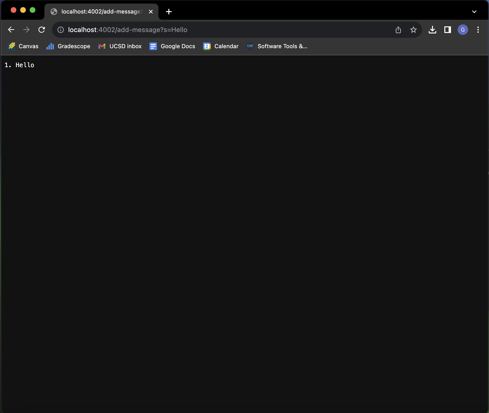
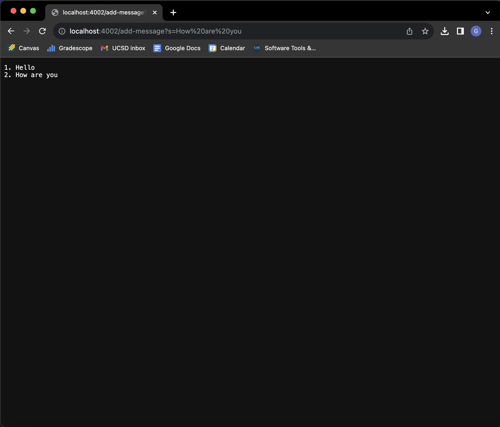
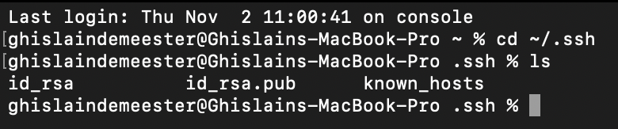
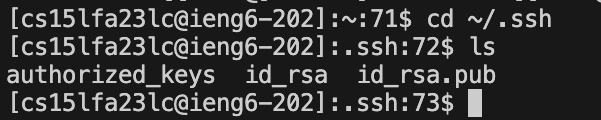
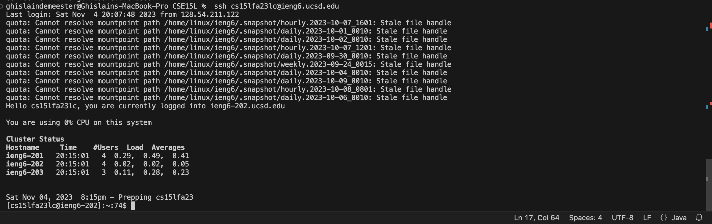

# Part 1, This is my code for StringServer.java:

```
import java.io.IOException;
import java.net.URI;

class Handler implements URLHandler {
    
    int num = 0;
    String message = "";

    public String handleRequest(URI url) {
        if (url.getPath().equals("/")) {
            return message;
        } 
           
            
         else {
            if (url.getPath().contains("/add-message")) {
                String[] parameters = url.getQuery().split("=");
                if (parameters[0].equals("s")) {
                    num += 1;
                    message = message + String.format("%d. %s\n", num, parameters[1]);
                    return message;
                }
            }
            return "404 Not Found!";
        }
    }
}

class StringServer {
    public static void main(String[] args) throws IOException {
        if(args.length == 0){
            System.out.println("Missing port number! Try any number between 1024 to 49151");
            return;
        }

        int port = Integer.parseInt(args[0]);

        Server.start(port, new Handler());
    }
}

```

## This is what happened after I used /add-message?s=Hello


1) The methods in my code that were called were handleRequest and main
   - handleRequest gets the https request and adds a string when imputed in the URl
   - main is a way to get the server started
     
2) The relevant argument to handle request are
   - num which keeps track of number of messaged that have been added so it starts at 0 and when the first line is added it gets incremented to 1.
   - message which stores the added message which in this case is Hello\n we need \n to get the next message on the next line.
     
3) The value of message changes from "" to "1. Hello\n"
   - the value of num changes from 0 to 1
## This is what happened after I used /add-message?s=How are you


1) The methods in my code that were called were handleRequest and main
   - handleRequest gets the https request and adds a string when imputed in the URl
   - main is a way to get the server started
2) The relevant argument to handle request are
   - num which keeps track of number of messaged that have been added so it starts at 0 and when the first line is added it gets incremented to 1.
   - message which stores the added message which in this case is Hello\n we need \n to get the next message on the next line.
3) The value of message changes from "1. Hello\n" to "1. Hello\n2. How are you\n"
   - the value of num changes from 1 to 2

# Part 2:

## Private key on my computer



The private key is id_rsa

## Public key on remote login



The public key is id_rsa.pub

## Login with no password




# Part 3:

Something I learnt that was important during week 2 and 3 is setting up a local web server as I believe that it can be important for companies to store data or interact with customers. Another thing I found interesting was the scp and mkdir command, even though I already had some knowledge on how to use mkdir, scp was brand new to me and it was interesting to me to understand how it worked.
